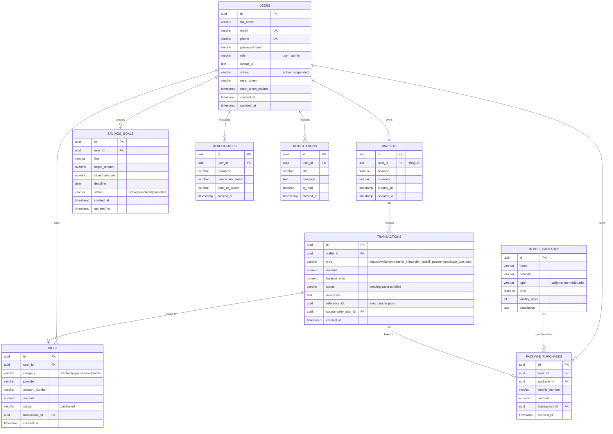

# Entity Relationship Diagram — Devs Wallet

## Relationship Notes

- **users ↔ wallets**: one-to-one. Every user gets exactly one wallet created at registration time (inside the same DB transaction as the user insert, so a user can never exist without a wallet).
- **wallets ↔ transactions**: one-to-many. Every money movement (deposit, withdraw, transfer, bill payment, package purchase) creates an immutable transaction row against the wallet, with `balance_after` as a running snapshot for fast history rendering.
- **transfers**: implemented as a linked pair of rows — a `transfer_out` on the sender's wallet and a `transfer_in` on the recipient's wallet, joined by `reference_id`. Both are written atomically in a single DB transaction.
- **bills / package_purchases → transactions**: each bill payment or package purchase writes a `transactions` row first, then stores its id as a foreign key back on the `bills`/`package_purchases` row, giving a full audit trail.
- **savings_goals**: contributions withdraw from the wallet and increase `saved_amount`; the goal auto-flips to `completed` once `saved_amount >= target_amount`.
- **beneficiaries**: a beneficiary must be an existing Devs Wallet user (validated by email lookup) — this is a curated recipient list layered on top of `users`, not a separate contact system.
